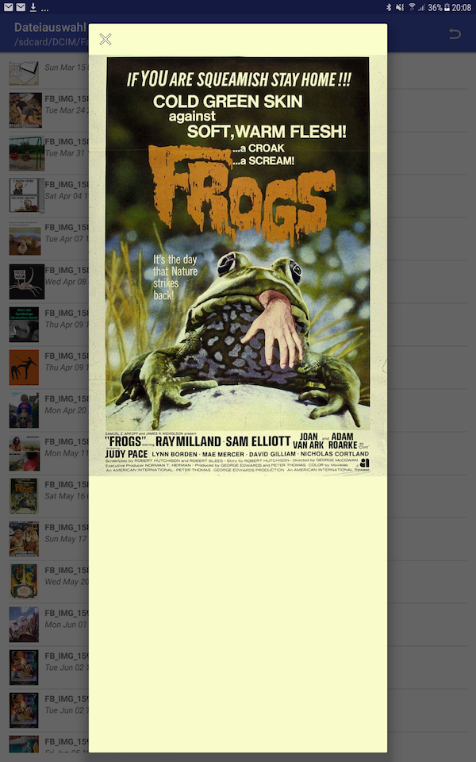

File Dialog Tool
----------------
File Dialog Tool is an activity which alows browsing the file system of your
device and pick file paths for loading or saving data.

An example of how to use this library in your own project can be found here: [Example app mainActivity](app/src/main/java/berthold/filedialog)

Screenshots of the running activity
===================================

Browsing.

When called with 'save- file' option, a floatig action button to do so is displayed. Argument returned will show if just the folder or folder and file was picked.

Preview feature.
