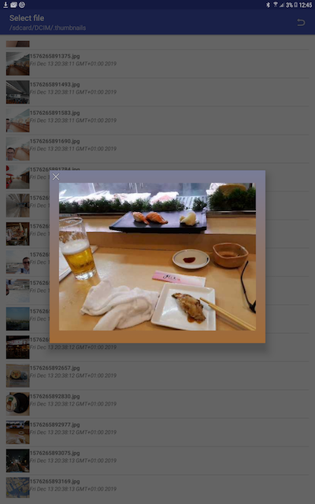

File Dialog Tool
----------------
File Dialog Tool is an activity which alows browsing the file system of your
device and pick file paths for loading or saving data.

Preview feature.

Browsing.

When called with 'save- file' option, a floatig action button to do so is displayed.
Argument returned will show if just the folder or folder  file was picked.

