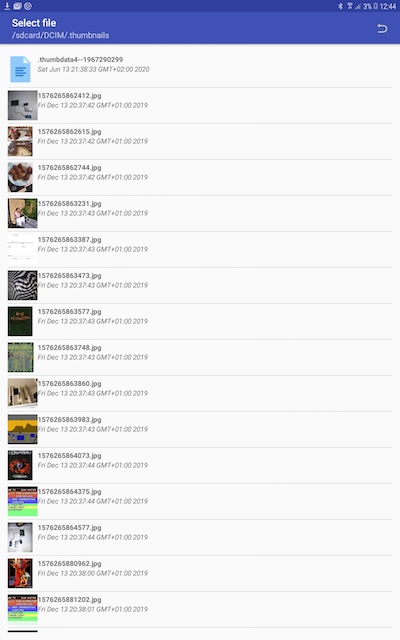
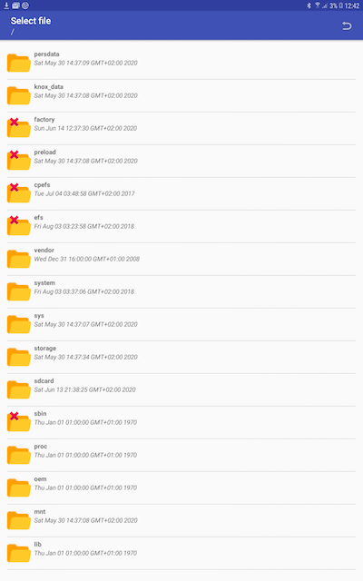

File Dialog Tool
================
<i>File Dialog Tool</i> is an activity which allows to browse through the file system of your
device and pick file paths for loading or saving data.

An example of how to use this library in your own project can be found here: [Example app mainActivity](app/src/main/java/berthold/filedialog)

Screenshots 
-----------

Browsing.

When called with 'save- file' option, a floatig action button to do so is displayed. The arguments returned will show if just the folder or folder and file was picked.

Preview feature.

Import this library into your own <i>Android Studio</i> project
---------------------------------------------------------------
The first step is to prepare your Android Studio's 'build.gradle' files (Project level and module level). The second step is to allow the permissions needed by the app.

<b>Project level</b>

Under 'allprojects' insert the following line:

    maven { url 'https://jitpack.io' }
    
   
<b>Module level (usually your 'app'- module)</b>

Under 'dependencies' insert this line:

    implementation 'com.github.codingbychanche:FileDialogTool:master-SNAPSHOT'
    
In the example above the 'SNAPHOT'- tag is used to download the latest version of the code. You should
check for the latest release under the 'Relase' tab of this repository and use that instead to 
import a stable release.

Permissions
-----------
Add the following permissions to your app's 'manifest'- file:

    <uses-permission android:name="android.permission.WRITE_EXTERNAL_STORAGE"></uses-permission>
    <uses-permission android:name="android.permission.READ_EXTERNAL_STORAGE"></uses-permission>

Before starting the app for the first time on your device, you need to set the app's permission to access
internal memory (got to settings => app => permissions).

Add new activity to your manifest file
--------------------------------------
Finally add:

     <activity android:name="berthold.filedialogtool.FileDialog"/>

